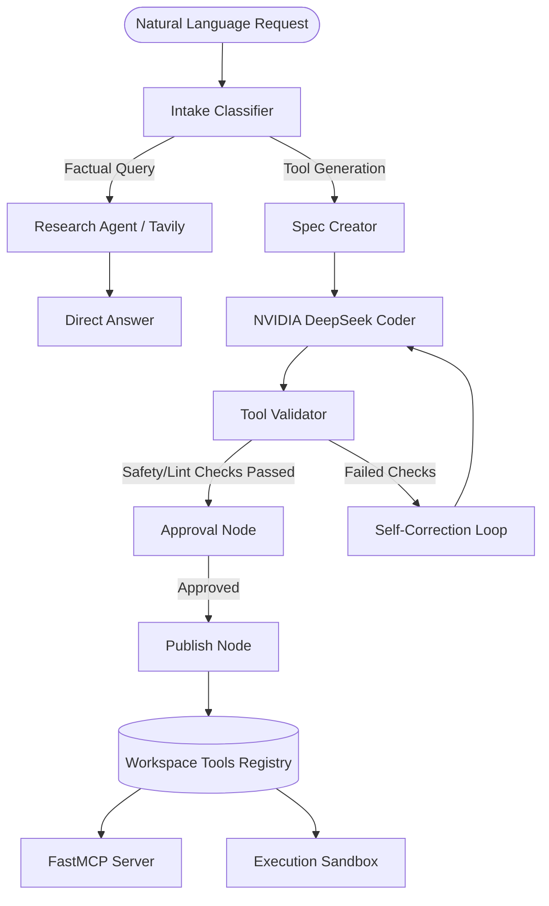

# Dynamic MCP Skill Hub

Dynamic MCP Skill Hub is a filesystem-first, database-free Python backend and dashboard for automatically creating, validating, versioning, publishing, and executing Model Context Protocol (MCP) tools.

---

## 🗺️ System Architecture



---

## 🚀 Key Features

*   **Natural Language Coding:** Generates fully functional Python tools from natural language requests.
*   **Self-Correction Loop:** Validates tool syntax and schema safety, feeding compiler errors back to the LLM (DeepSeek V4 Pro) for auto-debugging.
*   **Immutable Versioning:** Stores generated tool versions as immutable directories under `workspace/tools` without needing an external database.
*   **Dual Mode:** Can be run as a headless, stdio-compatible FastMCP server or as a comprehensive Web UI dashboard.
*   **Multi-Model Router:** Integrates Gemini 2.5 Flash as the default router, Groq Llama 3.3 as high-concurrency fallback, and NVIDIA NIM (DeepSeek V4 Pro) for code generation.

---

## 📂 Repository Layout

```text
├── .github/workflows/    # CI/CD pipelines (unit testing & code checks)
├── app/                  # Main entry point for the Reflex UI
├── src/
│   └── dynamic_mcp_skill_hub/
│       ├── agent/        # LangGraph agent orchestrators
│       ├── codegen/      # Python tool code generators
│       ├── config/       # Environment loading (Pydantic Settings)
│       ├── execution/    # Sandbox runner
│       ├── llm/          # Multi-model routing client
│       ├── mcp/          # FastMCP server registration
│       ├── storage/      # Filesystem tool registry
│       ├── utils/        # Rotating structured logging configuration
│       └── validation/   # Code compilation & validation
├── workspace/
│   ├── logs/             # Rotating execution logs (app.log)
│   ├── runtime/          # Sandbox temp executions
│   └── tools/            # Immutable tools registry
├── Dockerfile            # Production-grade multi-stage Docker image
├── docker-compose.yml    # Service composer for server and dashboard
├── Makefile              # Local developer task mapping
└── rxconfig.py           # Reflex UI dashboard settings
```

---

## 🛠️ Local Development Setup

### Prerequisites
*   Python 3.11 or 3.12
*   Node.js v20+ and npm (Required for Reflex UI frontend)

### Installation
Configure the workspace using the helper `Makefile`:

```bash
# Clone the repository
git clone https://github.com/ketantiwari/MCP-Skill-Hub.git
cd MCP-Skill-Hub

# Create and activate virtual environment
python -m venv .venv
source .venv/bin/activate  # On Windows: .venv\Scripts\activate

# Install dependencies and dev packages
make install
```

Configure your credentials by copying the environment template:
```bash
cp .env.example .env
# Edit the .env file with your model and API keys
```

### Development Commands
*   **Start headess MCP Server:** `make run-mcp`
*   **Start Reflex UI Dashboard:** `make run-ui`
*   **Run unit test suite:** `make test`
*   **Clean all caches and temp files:** `make clean`

---

## 🐳 Docker Deployment Setup

### 1. Build Image Locally
To build the multi-stage, non-root user production image:
```bash
make docker-build
```

### 2. Multi-Service Container Orchestration (Docker Compose)
Start the entire service stack (FastMCP server + UI dashboard) in the background with persistent directory mapping:
```bash
make docker-run
```

This launches:
*   **`ui-dashboard`** on ports `http://localhost:3030` (Frontend) and `http://localhost:8030` (Backend API).
*   **`mcp-server`** running FastMCP with a shared persistent `workspace/` volume mount.

---

## 📈 Logging & Observability

*   Logs are centralized in **`workspace/logs/app.log`** using `structlog` standard library wrapping.
*   The log file is automatically rotated when it reaches **10MB**, maintaining a maximum of **5 backup logs** to prevent filesystem exhaustion in production environments.
